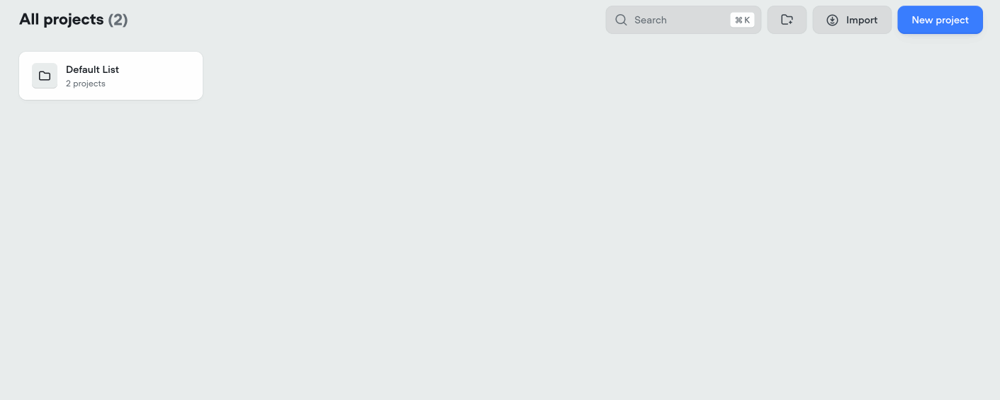
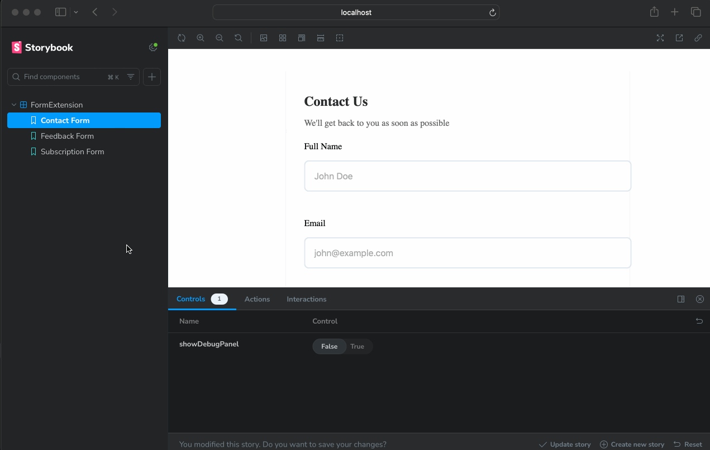

# Voiceflow Extension Development Kit

Build powerful, type-safe extensions for Voiceflow chat widgets using your favorite framework (React, Vue, Svelte, vanilla JS, etc) and have fun while doing it

[](#setup)

## Why Use This Kit

- 🔥 **Rapid Development**: Hot reloading and real-time testing in Storybook + V1 Voiceflow widget
- 🔒 **Type Safety**: Catch errors before runtime with TypeScript integration
- 🧪 **Easy Testing**: Test your extensions in isolation or with live Voiceflow widget
- 🛠️ **Developer Tools**: Built-in debugging and development utilities
- 🔐 **Security First**: Controlled dependency management and secure builds
- 🌟 **Conversation Design**: Build natural, intuitive experiences by collaborating with conversation designers to create extensions that seamlessly integrate into chat flows

## Why This Kit Exists

While you can get quite far with vanilla JavaScript when building Voiceflow chat widgets, as your extensions grow more complex, you'll likely encounter several challenges:

- **Canvas-Code Disconnect**: There's often a broken linkage between what's configured in the Voiceflow canvas and your implementation code (extension id's, what payloads are sent/returned, etc)
- **Development Environment**: Testing changes requires constant redeployment to see results in the actual widget-- also nice to focus and build extensions isolation focusing on crafting the best experience
- **Source Control**: Managing versions and collaborating becomes difficult without proper source control
- **Security Concerns**: Using external libraries via CDNs can pose security risks in production environments
- **Type Safety**: Lack of type checking can lead to runtime errors

This toolkit addresses these challenges by providing a structured development environment with buttery-smooth tooling.

## Setup

If you've never written code before untick the "I'm New to Coding" box below, otherwise get started on step 1 below

<details>
<summary>🐣 "I'm New to Coding"</summary>

## 0) Get the tools you'll need

You'll need three tools to get started building Voiceflow extensions on your machine:

- **Node.js**
- **Git**
- **A code editor**

Entering the commands below will require you to have a terminal open. If you're not sure how to open a terminal or where to start, see this guide for the basics: https://support.apple.com/guide/terminal/welcome/mac

### Setup Node on Your Computer

Node is a popular tool for running Typescript/JavaScript on web servers. Today, you'll use it to build your Voiceflow extension

You'll need to install NodeJS on your machine to run your extension in a Voiceflow widget. There are many ways to do that, but two easy ways:

**Option 1** Download + install Node from the official site: **[https://nodejs.org/en/download](https://nodejs.org/en/download)**

or

**Option 2** Download with **[Volta](https://docs.volta.sh/guide/)** in the terminal

```sh
curl https://get.volta.sh | bash

volta install node
```

Once you can run `node --version` in your terminal, you're good to go!

## Setup Git on Your Computer

Git is a tool for managing code. It's a way to keep track of changes you make to your code and collaborate with others.

The easiest way to install Git is to download it from the official site: **[https://git-scm.com/downloads](https://git-scm.com/downloads)** or to follow this guide: https://www.atlassian.com/git/tutorials/install-git

If you're looking for a graphical interface for git, you can download **[GitHub Desktop](https://github.com/apps/desktop)**

Long story short, if you can run `git --version` in your terminal, you're good to go!

You'll also need a code editor. You can use whatever you want, but two good choices are **[VSCode](https://code.visualstudio.com/)** or **[Cursor](https://www.cursor.com/)**

</details>

## 1) Fetch repo & install deps

If you're comfortable with Git, run:

```
git clone https://github.com/valgaze/extension-toolkit
cd extension-toolkit
npm install
```

Or follow the "I'm New to Coding" instructions above ☝️

This might take a few minutes to complete, so while you're waiting, let's get your Voiceflow project ready

## 2) Create an agent in Voiceflow

- If you don't have a Voiceflow account, create one here: **[https://creator.voiceflow.com/signup
  ](https://creator.voiceflow.com/signup)** and login

- From your Voiceflow dashboard, find the import button in the top right corner and import the **[project file (assets/voiceflow_project_file.vf)](./assets/voiceflow_project_file.vf)** to get up and running quickly

- The import flow will look roughly like this:



## 3) Open and "Run" your Voiceflow project

- Once you've imported the project file, open the project + select Workflows and then tap the "Edit Workflow" button


- 🛠️ Note: Everytime you make a change to your voiceflow project when developing your extension, you'll need to "Run" the project to see the changes in the Voiceflow widget. Press it once to run the project and publish the 1st development version that we'll use in the next few steps


## 4) Grab your project ID

- On your way out of Voiceflow, tap the Voiceflow settings button from the sidebar and copy the project ID under the metadata section-- you'll need this in the next step


## 5) Save your project ID to a .env file

- Back in your terminal, run the following command to create a `.env` file in the root of the repo and save your project ID to it

```sh
npm run setup
```


<details>
<summary>🛠️ Note: If you're comfortable with the command line, you can also create the .env file manually, tap here to see how</summary>

```sh
echo "VITE_VOICEFLOW_PROJECT_ID=your_voiceflow_project_id_here" > .env
```

</details>

## 6) Take it for a spin in Storybook

- Run the following command to start Storybook

```sh
npm run storybook
```

- This will start **[Storybook](https://storybook.js.org/)** and open a new browser window at `http://localhost:6006`

- Storybook lets you build and test your extensions in a sandbox environment. You can create different scenarios ("stories") to validate your extension's behavior, collaborate with team members, and ensure everything works perfectly before integrating with the chat widget. It's like a playground where you can experiment and fine-tune your extension without worrying (yet!) about the details of a large conversation system



## 7) Test with Live Widget

- Run the following command to start the live widget

```sh
npm run dev
```

- This will start the live widget and open a new browser window at `http://localhost:5173?autoload=true`

- The live widget is where you'll test your extension in the actual Voiceflow chat widget in conversation flows, make changes to the code and see the changes instantly.

- You can also test different scenarios and see if your extension submits data to the Voiceflow canvas as you expect.

- **Note:** If you're using the live widget, you'll need to click "Run" in the Voiceflow canvas to see the changes in the live widget


## 8) Build your extension

- Run the following command to build your extension

```sh
npm run build:extension
```

- This will bundle your extension and output it to the `dist/` directory where you can import it into your Voiceflow widget

If you want to see a fully working example, you can run the following command to build and serve the example

```sh
npm run serve:example
```

**IMPORTANT**: The files saved in the example-bundled will point to your PRODUCTION voiceflow project-- you'll need to click "publish" in the Voiceflow canvas to see the changes in the live widget to see updates for the production build


<details>
<summary>🛠️ Note: If you want to build a CDN-compatible extension, you can run the following command</summary>

```sh
npm run build:extension:cdn
```

This will output a `bundled_cdn.js` file in the `example-bundled` directory and an index.html which consumes the.

In short, you have two ways to build and deploy your extension:

#### 1. Standard Build (`npm run build:extension`)

- Outputs a module-based bundle
- Best for modern web applications
- Supports tree-shaking and optimized imports
- Use when you have control over the hosting environment

#### 2. CDN Build (`npm run build:extension:cdn`)

- Creates a globally accessible bundle that works via CDN
- Perfect for direct script inclusion in HTML
- Makes your extension available through `window.VoiceflowExtensions`
- Ideal when you need to:
  - Host your extension on a CDN
  - Include the extension directly in HTML via `<script>` tags
  - Support legacy systems or simpler integration scenarios

Example of using the CDN build:

```html
<!-- Load the extension(s) from your CDN -->
<script src="https://your-cdn.com/voiceflow-extension.js"></script>

<script type="module">
  // Import the extension(s) off window.VoiceflowExtensions
  const { FormExtension, VideoExtension } = window.VoiceflowExtensions;

  // Initialize Voiceflow Chat Widget
  // See documentation for deets: https://docs.voiceflow.com/docs/embed-customize-styling#customization-and-configuration
  (function (d, t) {
    var v = d.createElement(t),
      s = d.getElementsByTagName(t)[0];
    v.onload = function () {
      window.voiceflow.chat.load({
        verify: { projectID: "project_id_here" },
        url: "https://general-runtime.voiceflow.com",
        versionID: "production", // If 'production' you must click  PUBLISH on canvas to get updates, if development you need to press the Run button
        assistant: {
          extensions: [FormExtension, VideoExtension],
        },
      });
    };
    v.src = "https://cdn.voiceflow.com/widget-next/bundle.mjs";
    v.type = "text/javascript";
    s.parentNode.insertBefore(v, s);
  })(document, "script");
</script>
```

</details>

## Development Workflow

### Available Scripts

| Command                       | Description                                                                                                                            |
| ----------------------------- | -------------------------------------------------------------------------------------------------------------------------------------- |
| `npm run storybook`           | Start Storybook development environment w/ HMR (port 6006)                                                                             |
| `npm run dev`                 | Run extension in live Voiceflow widget with live-reload (port 5173)                                                                    |
| `npm run dev:mobile`          | Run extension in live Voiceflow widget with network IP address exposed so a phone on same network can connect, live-reload (port 5173) |
| `npm run build:extension`     | Build production-ready extension bundle                                                                                                |
| `npm run build:extension:cdn` | Build production-ready CDN-compatible extension bundle                                                                                 |
| `npm run serve:example`       | Build and serve example with bundled extension, output in `example-bundled` directory                                                  |
| `npm run serve:example:cdn`   | Build and serve example with CDN-compatible bundled extension, output in `example-bundled` directory                                   |

### Development Process

1. **Start in Storybook** (`npm run storybook`)

   - Develop components in isolation, write "stories" specifying the data from the Voiceflow canvas
   - Test all conversation paths
   - Hot Module Replacement (HMR) enabled, instant updates a soon as you make a change
   - Available at `http://localhost:6006`

2. **Test with Live Widget** (`npm run dev`)

   - Upload the **[Voiceflow Project File](./assets/voiceflow_project_file.vf)** to your Voiceflow project and press "Run" to publish to the development environment
   - Test in real Voiceflow chat widget
   - Available at `http://localhost:5173?autoload=true`

3. **Production Build** (`npm run build:extension`)
   - Bundle your extension for production
   - Output to `dist/` directory
   - Ready for inclusion into a voiceflow widge

The sample project takes care of all the setup for you, but if you want to know how it works on the canvas when building a extension that transmits data back to the canvas (ie forms, configurators, date/time/appointment pickers, etc) here's a quick guide

## Step I: Create a custom action node in Voiceflow

Extensions in this toolkit use a **[config.ts](./src/extensions/config.ts)** that defines

1. Basic Extension Info:

   - `id`: Unique identifier for your extension (used in Voiceflow canvas)
   - `name`: Display name of your extension
   - `supports_dark_mode`: flag if the extension supports dark mode in browsers

2. Extension Payload:
   - This is a specification of the data that the extension needs from Voiceflow (ex. what payloads are sent/returned, etc)

Below is an example of a custom action node in Voiceflow that uses the extension id `ext_react_form`-- you can call this whatever you want but make sure you put the same id in the config.ts file


**Stop on Action:** When creating an action you can tap the toggle if you want your conversation diagram to "wait" for the extension to send something back before continuing the conversation

Add the extension to **[index.tsx](./src/index.tsx)**

## Step II: Create a "Javascript step" in Voiceflow

Once your extension completes and transmits data back to the canvas, you'll need to create a javascript step to handle the data and pluck it out


## Step III: Use the values in Voiceflow

You can now access the values you extracted in the javascript step in your voiceflow project


**Note:** You'll need to tap each variable in curly braces to make it a "variable" accessible anywherein the canvas

From there you can make any extension you want-- most extensions are "response" extensions that send a message back to the canvas but you can also build "effect" extensions that don't send data back to the canvas and do something in the webpage holding your Voiceflow widget (like update a progress bar, show a loading indicator, etc)

Armed with this toolkit, you're ready to create powerful, production-ready Voiceflow extensions. Whether you're building complex form handlers, interactive visualizations, or custom UI components, you now have the foundation for reliable, type-safe development. Extensions are powerful and FUN!

## Resources

- [Voiceflow Extension Docs](https://docs.voiceflow.com/docs/custom-web-chat-widgets)
- [Voiceflow Extensions Starter Repo](https://github.com/voiceflow-gallagan/vf-extensions-demo)
- [Styling Voiceflow Webchat](https://docs.voiceflow.com/docs/embed-customize-styling)
- [Voiceflow QR Code Extension](https://github.com/valgaze/voiceflow-qrcode)

## License

MIT
